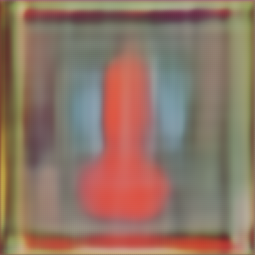
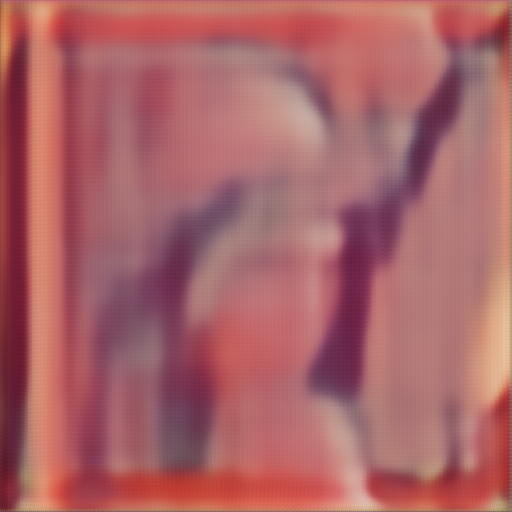
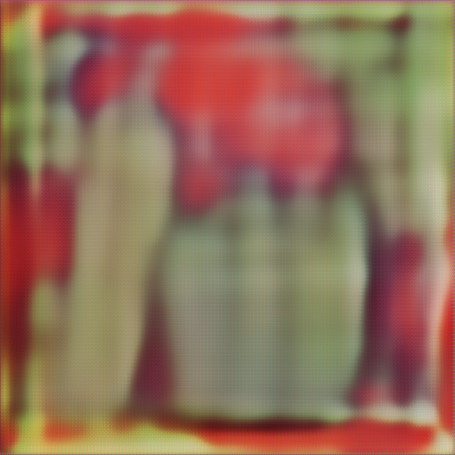

# Image compression using variational auto-encoder

This project is a simple implementation of auto-encoder neural network for image compression.
The auto-encoder neural network is trained on the ImageNet dataset. The trained model is then used to compress and
decompress the images.

## Model architecture

Model represents a variational auto-encoder with residual blocks and skip connections.

* Encoder: _ResNet-18 architecture with fully connected layers_
* Decoder: _ResNet-18 architecture with transposed convolution layers_
* Loss: _VGG loss + MSE loss_

## Download pretrained models

Models were trained on ImageNet dataset subset (20000 images).

Here are the links to download the pretrained models:
_B = number of quantization levels_

* [B=2, resnet18](https://drive.google.com/drive/folders/1FaeWzeRW3BMqqZwGsHUjhf7PuAOsiY6E?usp=sharing)
* [B=8, resnet18](https://drive.google.com/drive/folders/1fYDc0e43cUR7xsIYatpz8fdJ_6KMJmSs?usp=sharing)

Put downloaded models in `models` directory.

## Quick example:

[compress_all.sh](scripts/compress_all.sh) compresses all images from `assets/images` directory and saves them
in `assets/compressed` directory.

`compress_all.sh` takes 3 arguments:

* `qb` - number of quantization levels
* `resnet-model` - resnet model architecture
* `device` - torch device to evaluate on

```shell
# Compress all images from assets/images directory
bash scripts/compress_all.sh 8 resnet18 cpu
```

[decompress_all.sh](./scripts/decompress_all.sh) decompresses all images from `assets/compressed` directory and saves
them in `assets/decompressed` directory.

`decompress_all.sh` takes 3 arguments:

* `qb` - number of quantization levels
* `resnet-model` - resnet model architecture
* `device` - torch device to evaluate on

```shell
# Decompress all images from assets/compressed directory
bash scripts/decompress_all.sh 8 resnet18 cpu
```

## Compression

```shell
# Compress the `baboon` image from assets/images directory
python compress.py \
  --image=assets/images/baboon.png \
  --output=assets/compressed/baboon.bin \
  --models_dir=models \
  --resnet-model=resnet18 \
  --qb=8 \
  --device=cuda
```

## Decompression

```shell
# Decompress the compressed image
python decompress.py \
  --file=assets/compressed/baboon.bin \
  --output=assets/decompressed/baboon.png \
  --qb=8 \
  --resnet-model=resnet18 \
  --models_dir=models \
  --device=cuda
```

## Training from scratch

```shell
python train.py \
  --root [path to images] \
  --test-root [path to test images] \
  --resnet-model [resnet model architecture] \
  --qb [number of quantization levels] \
  --epochs [number of epochs] \
  --batch_size [batch size] \
  --lr [learning rate] \
  --device [torch device to train on] \
  --save_results_every [save results every n epochs] \
  --save_models_dir [path to save models]
```

## Results

### Compression size comparison

```shell
╰─ du -h assets/compressed/*
# 60K    assets/compressed/baboon.bin
# 60K    assets/compressed/lena.bin
# 60K    assets/compressed/peppers.bin
```

```shell
╰─ du -h assets/images/*     
  
# 624K    assets/images/baboon.png
# 504K    assets/images/lena.png
# 528K    assets/images/peppers.png
```

### Images

|              Original               |                   B=2                   |                    B=8                    |
|:-----------------------------------:|:---------------------------------------:|:-----------------------------------------:|
|  |  |  |
|      |      |      |
|  |  |  |