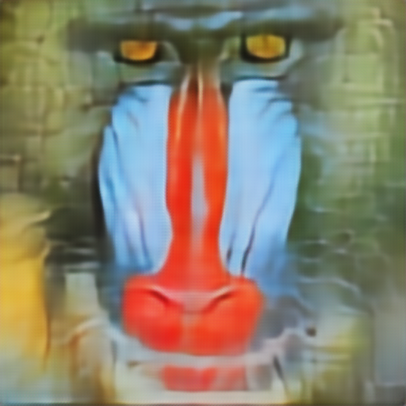

# Image compression using neural auto-encoder and quantization

[](https://opensource.org/licenses/MIT)

This project is a simple implementation of auto-encoder neural network for image compression.
The auto-encoder neural network is trained on the ImageNet dataset. The trained model is then used to compress and
decompress the images.

## Navigation:

* [Model architecture](#model-architecture)
* [Download pretrained models](#download-pretrained-models)
* [Quantization](#quantization)
* [Quick start](#quick-start)
* [Compression](#compression)
* [Decompression](#decompression)
* [Training from scratch](#training-from-scratch)
* [Results](#results)
* [Notebooks](#notebooks)

## Model architecture

Model represents a variational auto-encoder with residual blocks and skip connections.

* Encoder: _ResNet-18 architecture with fully connected layers_
* Decoder: _ResNet-18 architecture with transposed convolution layers_
* Loss: _VGG loss + MSE loss_
* Optimizer: _Adam optimizer_

## Download pretrained models

Models were trained
on [130k Images (512x512) - Universal Image Embeddings](https://www.kaggle.com/datasets/rhtsingh/130k-images-512x512-universal-image-embeddings)
dataset from Kaggle.

Here are the links to download the pretrained models:
_B = number of quantization levels_

* [B=2, resnet18](https://drive.google.com/drive/folders/1FaeWzeRW3BMqqZwGsHUjhf7PuAOsiY6E?usp=sharing)
* [B=8, resnet18](https://drive.google.com/drive/folders/1fYDc0e43cUR7xsIYatpz8fdJ_6KMJmSs?usp=sharing)

Put downloaded models in `models` directory.

## Quantization

Model outputs feature maps with 512 channels and 8 x 8 spatial dimensions. Then the feature map are flattened and
become a vector of size 32768. The vector is then quantized into `B` quantization levels.

### Train quantization

In training phase `noise` is appended to the input image. The `noise` is sampled from N(-0.5, 0.5) and then noise scaled
by
`B` quantization levels. So the final noise vector is

```python
scale = 2 ** -B
noise = (torch.randn(n) * 0.5 - 0.5) * scale
```

### Inference quantization

In inference mode vector is quantized using `torch.clamp(0, 1)` and then scaled by `B` quantization levels.
So the final quantized vector is

```python
torch.clamp(vector, 0, 1) * 2 ** B + 0.5
```

## Quick start

[compress_all.sh](scripts/compress_all.sh) compresses all images from `assets/images` directory and saves them
in `assets/compressed` directory.

`compress_all.sh` takes 3 arguments:

* `qb` - number of quantization levels
* `resnet-model` - resnet model architecture
* `device` - torch device to evaluate on

```shell
# Compress all images from assets/images directory
bash scripts/compress_all.sh 8 resnet18 cpu
```

[decompress_all.sh](./scripts/decompress_all.sh) decompresses all images from `assets/compressed` directory and saves
them in `assets/decompressed` directory.

`decompress_all.sh` takes 3 arguments:

* `qb` - number of quantization levels
* `resnet-model` - resnet model architecture
* `device` - torch device to evaluate on

```shell
# Decompress all images from assets/compressed directory
bash scripts/decompress_all.sh 8 resnet18 cpu
```

## Compression

In compression phase the encoder encodes the image into a vector of size 32768. Then the vector is quantized into
`B` quantization levels. And finally the quantized vector is compressed using `Adaptive Arithmetic Coding`.

Final compressed file consists of:

* `vector` - quantized vector
* `shape` - feature map shape

```shell
# Compress the `baboon` image from assets/images directory
python compress.py \
  --image=assets/images/baboon.png \
  --output=assets/compressed/baboon.bin \
  --models-dir=models \
  --resnet-model=resnet18 \
  --qb=8 \
  --device=cuda
```

## Decompression

In decompression phase the compressed file is decompressed using `Adaptive Arithmetic Coding`. Then the decompressed
vector is dequantized and decoded by the decoder. The decoder outputs the decompressed image.

dequantized vector = `vector / (2 ** qb)`

```shell
# Decompress the compressed image
python decompress.py \
  --file=assets/compressed/baboon.bin \
  --output=assets/decompressed/baboon.png \
  --qb=8 \
  --resnet-model=resnet18 \
  --models-dir=models \
  --device=cuda
```

## Training from scratch

```shell
python train.py \
  --root [path to images] \
  --test-root [path to test images] \
  --resnet-model [resnet model architecture] \
  --qb [number of quantization levels] \
  --epochs [number of epochs] \
  --batch-size [batch size] \
  --lr [learning rate] \
  --device [torch device to train on] \
  --save-results-every [save results every n epochs] \
  --save-models-dir [path to save models] \
  --use-checkpoint [use checkpoint to resume training]
```

## Results

### Images

#### B=2

| Jpeg QF |                   Jpeg                   |                  Auto-Encoder                   |
|--------:|:----------------------------------------:|:-----------------------------------------------:|
|      12 |    |    |
|      35 |        |        |
|      33 |  |  |

#### B=8

| Jpeg QF |                   Jpeg                   |                  Auto-Encoder                   |
|--------:|:----------------------------------------:|:-----------------------------------------------:|
|      72 |    |    |
|      90 |        |        |
|      89 |  |  |

### PSNR / BPP


## Notebooks

* [Kaggle training notebook](notebooks/kaggle-cuda-training.ipynb)
* [Analysis notebook](notebooks/analysis.ipynb)